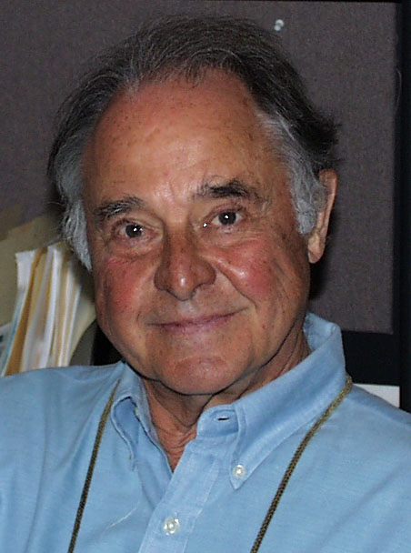
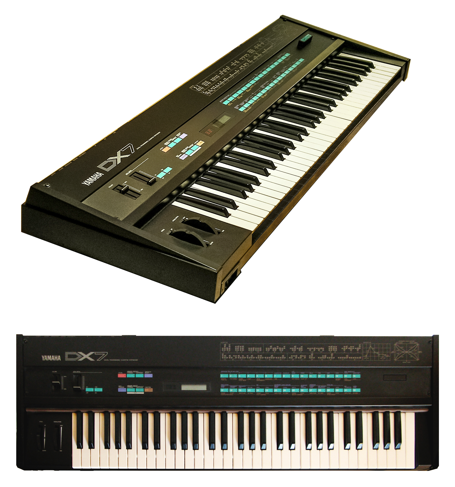
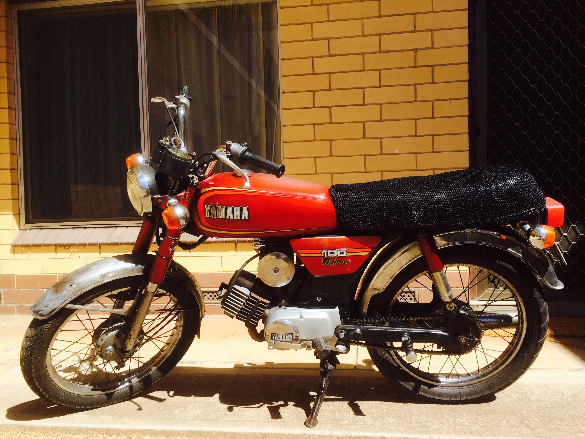
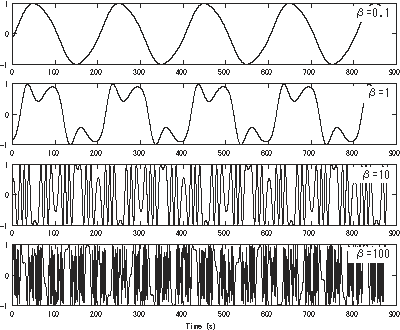
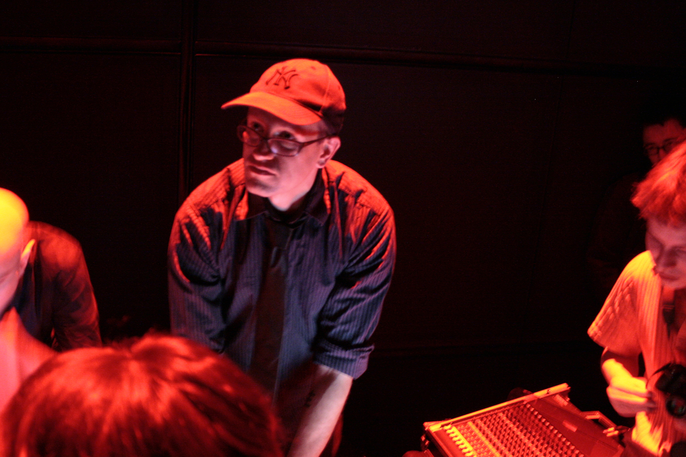

# Operator: The FM Machine

*Companion reading for Episode 1 of* Ableton Live Mastery.

A walking-podcast on what FM synthesis is, where it came from, and how
Ableton's *Operator* is the descendant of every machine on these pages.
Read alongside the episode, or after.

\newpage

## John Chowning

{width=70%}

\medskip

In 1967, in the basement of the Stanford Artificial Intelligence Lab, John
Chowning was trying to make a sound wobble. He turned the wobble up. He turned
it up further. And somewhere around twenty cycles per second, the wobble
disappeared — and an entirely new spectrum appeared in its place.

What he had stumbled into was Frequency Modulation: when you modulate one
oscillator's pitch with another, fast enough to cross into audio rate, the
result isn't vibrato anymore — it's a brand-new harmonic series, sidebands
spreading outward from the carrier at integer multiples of the modulator
frequency. The math, eventually, was the math of Bessel functions.

Chowning published his paper in 1973 (*The Synthesis of Complex Audio Spectra
by Means of Frequency Modulation*, JAES). Stanford patented the technique. The
American keyboard manufacturers — Hammond, Wurlitzer, Lowrey — all said no.
Yamaha, in 1974, said yes, and paid the largest royalty stream in Stanford's
patent-office history.

\newpage

## Yamaha DX7 (1983)

{width=85%}

\medskip

The DX7 was the first commercially successful all-digital synthesizer. Six
operators, 32 algorithms, 16-voice polyphony, no analog filter — just
arithmetic, pure FM. It launched at \$1,995 in 1983 and sold over 200,000
units. Whitney Houston, Phil Collins, Brian Eno, Hall & Oates, Stevie Wonder
— for half a decade after the DX7 hit shelves, the sound of a pop record
*was* the sound of a DX7.

The factory presets — *E.PIANO 1*, *FANTASY*, *BASS 1* — became reflexes:
listeners didn't know they were hearing FM, they were just hearing the
eighties. The four-page LCD menu structure made deep editing nearly
impossible, which is why most DX7s in studios across the world ran the same
factory bank, which is why so many records sound like they share a synth.
They did.

The DX7 also broke the working keyboardist's mental model. There was no
oscillator-filter-VCA. There were operators. There were algorithms. There
was modulation index — a number — and it determined brightness directly,
not by turning a knob labeled CUTOFF. A whole generation of patch designers
had to start over.

\newpage

## Yamaha TX81Z (1987)

The TX81Z was Yamaha's third 4-operator FM module — half the operators of
the DX7, fraction of the price, sat in a single rack space, controlled
entirely by MIDI. It shipped with 128 factory presets including one that
would outlive the entire decade: **Lately Bass**, preset *P1-08*.

Once the DX7's prestige collapsed in the early-90s analog-revival backlash,
the TX81Z stayed cheap on the second-hand market — \$80 for a working unit —
and got picked up by every Detroit techno producer, IDM head, and house
loop-builder who needed a deep, harmonically-rich bass that wasn't a 303 or
a Moog. Lil Louis dropped it on *French Kiss*. Kerri Chandler made it sing.
Squarepusher hammered it.

The interface was cruel: two-row LCD, six buttons, parameter scrolling
that took thirty seconds to get to *anything*. Nobody minded. The TX81Z
became an ingredient — programming was for masochists; you used what was
there. Ableton Operator, twenty years later, would explicitly target this
form factor: 4-operator FM, all parameters on screen at once, no LCD.

\newpage

## Yamaha DX100 (1985)

{width=80%}

\medskip

The DX100 was the home-keyboard cousin of the TX81Z — a 49-key 4-op FM
synthesizer with a strap button on the side, a built-in speaker, and a
*\$445* price tag. Aimed at hobbyists, it ended up in the hands of every
broke producer who couldn't afford a DX7. Aphex Twin had one. So did
Squarepusher. So did half the Warp Records roster.

Whatever you have to say about the *Lately Bass* mythology, the more
interesting historical thread is that the entire bottom of the IDM world
was scaffolded on cheap 4-operator hardware: people who couldn't afford the
canonical machine but wanted the canonical sound, who learned FM the slow
way through the toy version. The texture you hear in *Selected Ambient
Works 85-92* — the cracked, dust-flecked, harmonically-dense pad work —
that's a DX100 a teenager couldn't afford to replace.

\newpage

## Frequency Modulation, Visualized

{width=75%}

\medskip

What FM produces is *sidebands*: pairs of partials sitting at the carrier
frequency plus and minus integer multiples of the modulator frequency. As
the modulation index (the modulator's amplitude) goes up, more sidebands
appear, the spectrum gets brighter, and the energy distribution follows the
shape of the Bessel functions of the first kind.

Two consequences fall out of this:

1. **Brightness is a number.** Modulation index = brightness. You don't
   sweep a filter cutoff; you raise a level. This is why FM brass and FM
   bells respond so differently to velocity than analog instruments do.
2. **Ratio is timbre.** When carrier-to-modulator is an integer (1:1, 1:2,
   1:3), the sidebands fall on the harmonic series and you get
   pitched-instrument timbres. When it's irrational (1 : √2, 1 : φ), the
   sidebands fall *off* the harmonic series and you get bells, gongs,
   metal — *inharmonic* spectra. The same math, different ratio,
   completely different instrument.

\newpage

## Robert Henke

{width=70%}

\medskip

Robert Henke — half of *Monolake*, co-author of the Ableton Live engine —
sat down in 2003 with a copy of the Chowning paper and a directive from
Ableton's design team to build a synthesizer that fit the company's
philosophy: minimal interface, immediate response, every parameter on screen
at once. The result, shipped with Live 4 in 2004, was *Operator*: 4
operators, 11 algorithms, no menus, no LCD, no preset-burning culture.

The design choices it made tell you the lineage:

- **4 operators**, not 6. The TX81Z form factor — enough modulation depth
  for serious work, not enough to drown the user in algorithm choices.
- **11 algorithms**, hand-picked from the DX7's 32. The omitted ones were
  redundant or rarely useful at 4-op.
- **A filter at the end of the chain.** Pure FM purists scoffed; everyone
  else cheered. A filter on the carrier output is a much faster way to
  warm up an FM patch than reprogramming the modulator envelope.
- **Beat-rate envelopes.** Operator can sync any of its envelopes to a
  rhythmic subdivision, retriggering on every 16th note or 8th-dotted.
  This is *not* in the DX7 lineage — this is Henke writing for IDM
  producers, the people who would actually buy Live.

\newpage

## Operator (Ableton, 2004)

A 4-operator FM synthesizer that ships with every copy of Live since version
4. The core architecture:

- **Four operators** (A, B, C, D), each with its own oscillator, envelope,
  and routing.
- **Eleven algorithms** define which operator modulates which other
  operator. In Algorithm 1, all of B, C, D modulate A; A is the only
  carrier. In other algorithms, operators stack into chains.
- **Per-operator parameters**: Coarse, Fine, Level, Wave (sine, saw, square,
  noise, user-loaded), Phase, Feedback, full ADSR + slope curves, envelope
  modes (None, Loop, Beat, Sync, Trigger).
- **A filter** at the end of the chain (12dB or 24dB lowpass/highpass/
  bandpass/notch/morph, with circuit emulation modes: Clean, OSR, MS2, SMP,
  PRD).
- **Voice-spread, glide, transpose, pan, tone, drive — all on one screen.**

The patch I'll build in the second half of the episode (*Polynomial-Bell*) uses
Algorithm 1, three sine operators, a √2 modulator ratio, a touch of
feedback, the OSR-circuit lowpass at 8 kHz, 12% spread, and an envelope
shaped to pluck. Same patch family Aphex used on *Polynomial-C*. Same patch
family the original CCRMA bell synthesis demos produced in 1973.

You can build it in twenty minutes. Whether you can *use* it — that's the
two-decade-long argument the rest of the course is about.

\newpage

## Listening list (referenced in the episode)

- Aphex Twin — *Polynomial-C* (Drukqs, 2001)
- Aphex Twin — *Xtal* (Selected Ambient Works 85-92, 1992)
- Squarepusher — *Beep Street* (Hard Normal Daddy, 1997)
- Autechre — *Bike* (Incunabula, 1993)
- Autechre — *Black Refraction* (elseq, 2016)
- Brian Eno — *An Ending (Ascent)* (Apollo: Atmospheres & Soundtracks, 1983)
- A-ha — *Take On Me* (Hunting High and Low, 1985)
- Whitney Houston — *Greatest Love of All* (Whitney Houston, 1985)
- Lil Louis — *French Kiss* (Frequencies, 1989)
- John Chowning — *Stria* (1977 / CCRMA)

\bigskip

\noindent\rule{\linewidth}{0.4pt}

\smallskip

\footnotesize{Image credits: John Chowning (Wikimedia Commons / public domain).
Yamaha DX7 (Wikimedia Commons / Robert Carney, CC BY-SA 4.0). Yamaha DX100
(Wikimedia Commons / Steve Sims, CC BY-SA 3.0). Frequency-modulation spectrum
diagram (Wikimedia Commons / public domain). Robert Henke (Wikimedia Commons
/ Hideo Schwartz, CC BY-SA 3.0).}
